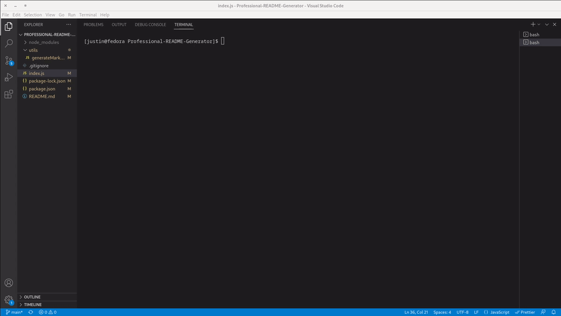

# Professional-README-Generator

## Description

This is a command-line application that dynamically generates a professional README.md file from a user's input using the [Inquirer package](https://www.npmjs.com/package/inquirer/v/8.2.4).

## Installation

Once the repo is cloned or downloaded the user will need to install the npm package(s):
 Open a terminal to the location inside the downloaded folder.
 Run 'npm i' to install the packages

## Usage

1. Enter a project title
2. Enter a description, installation instructions, usage information, contribution guidelines, and test instructions
3. choose a license for my application from a list of options
4. Enter my GitHub username
5. Enter my email address
* Links in the Table of Contents take the user to the corresponding section of the README
* File will be saved with the value of project title followed by an underscore and the README.dm (ex. TestProject_README.md)

   

## Credits

## License

